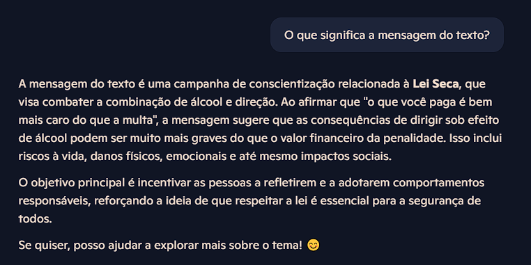

Este repositório documenta um projeto prático de reconhecimento de texto (OCR) utilizando serviços de Inteligência Artificial como o Copilot para extrair informações de imagens. O objetivo é demonstrar como a IA pode ser aplicada para converter conteúdo visual em texto estruturado e pesquisável.

As imagens utilizadas, foram:

- 
- 
- 

Resultados:

- Output da Imagem 1:
  - 
  - 

- Output da Imagem 2:
  - 
  - 

- Output da Imagem 3:
  - 
  - 

O Copilot se mostrou extremamente eficaz e preciso na conversão visual em texto, convertendo rapidamente as imagens apresentadas conservando o conteúdo apreentado.

Alguns dos benefícios gerados por esse tipo de processo, são:

1. Automatização de processos manuais:

Elimina a necessidade de digitação e leitura manual de documentos.

Processa rapidamente formulários, notas fiscais, contratos, etc.

2.  Indexação e busca inteligente
Transforma imagens em texto pesquisável.

Permite que sistemas de busca encontrem informações visuais com base em conteúdo semântico, e não só palavras-chave.

3. Economia de tempo e aumento de produtividade
Processos que antes levavam horas podem ser feitos em segundos.

Redução de erros humanos comuns em transcrição manual.

4. Geração de dados estruturados
Textos extraídos podem alimentar bancos de dados, planilhas, relatórios e dashboards automaticamente.

Facilita a análise de grandes volumes de documentos não estruturados.

5. Acessibilidade
Torna conteúdos visuais acessíveis a pessoas com deficiência visual, ao converter imagens em texto compatível com leitores de tela.
